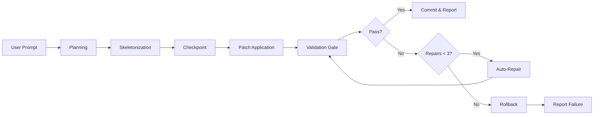

# FrozenFigma: Unified Architecture & Technical Plan

> **One-Sentence Goal:** A local, self-hosted environment that turns natural-language requests into **functional UI mock-ups** (clickable, stateful controls—no production backend), with guard-railed edit/apply cycles, tests/linters, auto-repair, and rollback.

---

## 0. North-Star Decisions (Working Defaults)

These are our core technical commitments that guide all implementation:

- **Host/runtime:** Phase 1 = **Pure Web** (Vite + React + TypeScript) for speed; Phase 2 = **Tauri (Rust)** wrapper for desktop windowing
- **Renderer:** React 18 + Tailwind (CSS vars for tokens) + slim component primitives
- **State & schema:** Zustand store + **Zod** schemas for graph, commands, and tokens
- **Agent strategy:** Local agent orchestrator (deterministic rules first) → optional LLM later; edits are **patch-based**, never full regenerate
- **Validation gate:** `lint → types → unit → smoke (headless render)`; auto-repair ≤ 3 tries; **atomic turn** (rollback on failure)
- **Persistence:** `ui.json` (graph) + per-turn artifacts; checkpoints via Git lightweight commits or FS snapshots
- **Export:** React TSX components + optional tokens.json

> We can swap any of these later; the blueprint assumes these as defaults for concreteness.

---

## 1. Vision & Core Value

**Vision:** A local, self-hosted "Figma Make"-equivalent that generates functional UI mock-ups from natural language.

**Core Value Proposition:**
- 100% local execution - no cloud services required
- Full transparency - every agent action is visible and auditable  
- Zero subscription costs - own your tool completely
- Production-grade validation - lint, type-check, test every change
- Atomic operations - changes either fully succeed or rollback entirely

**Functional Mock-up Definition:**
- Components are interactive (buttons click, sliders slide, modals open)
- All state is simulated (no real backends or databases)
- Behavior feels plausible and realistic within the mock-up runtime

---

## 2. Module Boundaries & Folder Layout

```
src/
  agent/
    planner/           # NL → Intent → EditPlan
    skeletons/         # settings, tabs, modal, tray, lens, card-grid, form
    patcher/           # graph mutations + AST patches (exported code)
    repair/            # diagnostics → fix proposals (deterministic)
    validator/         # gate orchestration + result aggregation
    reporter/          # turn summaries, artifact links
  
  app/
    view/              # Canvas, Inspector, Library, Console, CommandBar
    state/             # zustand store (graph, selection, session)
    theme/             # CSS var application; light/dark
  
  schema/              # zod: Graph, Node, ComponentSpec, Tokens, Command
  
  io/
    persistence/       # ui.json load/save; checkpoints
    artifacts/         # screenshots, logs, diffs
    export/            # TSX component/code emitters, tokens
  
  tests/
    smoke.test.tsx     # headless sanity
    components/*.test.tsx
    
  scripts/
    gate-runner.ts     # orchestrates validation pipeline
```

---

## 3. Code Domains & Responsibilities

### 3.1 Agent Orchestration
- **Planner**: Parse NL prompt → normalized intent → **EditPlan** (list of granular ops)
- **Skeletonizer**: Library of templates for common UIs → parameterized specs
- **Patcher**: Applies **graph-level** mutations (preferred) and AST patches for exports
- **Validator**: Runs the **gate**; aggregates diagnostics
- **Repairer**: Consumes diagnostics → proposes fixes → re-runs gate (max 3 attempts)
- **Reporter**: Emits turn summary (changes, diffs, artifacts, timings)

### 3.2 UI Graph & Data Model
- **Graph**: Canonical source of truth - nodes, props, layout, links
- **Tokens**: Colors, radius, spacing, typography - runtime-swappable
- **IDs & Addressability**: UUID v4 + name registry ("Settings.sidebar")
- **Schema**: Zod types with versioned migrations

### 3.3 Renderer & Interaction Surface
- **Canvas**: Renders Graph → live, interactive components
- **Inspector**: Shows selected node props (form + raw JSON)
- **Library**: Skeleton palettes; drag-to-add or via commands
- **Console**: Prompt input + per-turn logs + gate reports
- **Command Palette**: Cmd/Ctrl+K quick actions

### 3.4 Tooling & Gates
- **Gate Runner**: `npm run gate` orchestrates validation pipeline
- **Smoke Tests**: Headless render → assert canvas and nodes
- **Artifacts**: Screenshots, state diffs, error excerpts

### 3.5 Persistence & Export
- **Checkpoints**: Snapshot before each turn
- **Session Log**: JSONL + markdown summary
- **Exporters**: React TSX, tokens.json

---

## 4. Data Contracts (Schemas)

### 4.1 Core Schemas

```typescript
// Component Specification
const ComponentSpec = z.object({
  id: z.string().uuid(),
  type: z.enum([
    'button','slider','toggle','tabs','modal','tray','card',
    'card-grid','form','input','select','textarea','progress',
    'tooltip','popover','drawer','dialog','table','chart','lens',
    'settings-panel'
  ]),
  name: z.string().optional(), // Human-readable identifier
  props: z.record(z.any()).default({}),
  frame: z.object({
    x: z.number(),
    y: z.number(),
    w: z.number(),
    h: z.number(),
    region: z.enum(['header','sidebar','main','overlay','tray'])
  }),
  children: z.array(z.string()).optional(),
  parent: z.string().optional()
});

// UI Graph
const UIGraph = z.object({
  version: z.literal(1),
  nodes: z.array(ComponentSpec),
  connections: z.array(z.object({
    from: z.string(),
    to: z.string(),
    type: z.enum(['data', 'event', 'layout'])
  })).optional(),
  tokens: TokenSet,
  meta: z.object({
    createdAt: z.string().datetime(),
    updatedAt: z.string().datetime(),
    sessionId: z.string().uuid()
  })
});

// Agent Commands
const Command = z.discriminatedUnion('type', [
  z.object({ type: z.literal('ADD'), spec: ComponentSpec }),
  z.object({ type: z.literal('UPDATE'), id: z.string(), patch: z.record(z.any()) }),
  z.object({ type: z.literal('REMOVE'), id: z.string() }),
  z.object({ type: z.literal('MOVE'), id: z.string(), frame: ComponentSpec.shape.frame }),
  z.object({ type: z.literal('SET_TOKENS'), tokens: z.record(z.any()) }),
  z.object({ type: z.literal('BATCH'), commands: z.array(z.lazy(() => Command)) })
]);

// Design Tokens
const TokenSet = z.object({
  colors: z.record(z.string()),
  spacing: z.record(z.number()),
  radius: z.record(z.number()),
  typography: z.record(z.object({
    family: z.string(),
    size: z.number(),
    weight: z.number(),
    lineHeight: z.number()
  })),
  shadows: z.record(z.string()),
  theme: z.enum(['light', 'dark'])
});
```

### 4.2 Example EditPlan

```json
{
  "turnId": "2025-10-05T21:13:00Z",
  "actions": [
    { 
      "type": "ADD", 
      "spec": { 
        "id": "node-9", 
        "type": "settings-panel", 
        "props": { "sliders": 6, "toggles": 4 }, 
        "frame": { "x": 24, "y": 24, "w": 420, "h": 560, "region": "sidebar" } 
      }
    },
    { 
      "type": "ADD", 
      "spec": { 
        "id": "node-10", 
        "type": "tabs", 
        "props": { "labels": ["General","Display","Network"], "active": 1 }, 
        "frame": { "x": 460, "y": 24, "w": 820, "h": 560, "region": "main" } 
      }
    }
  ]
}
```

---

## 5. Agent Flow (Turn Lifecycle)



**Detailed Steps:**
1. **Input**: User prompt in Command Bar
2. **Planning**: Planner → intents → **EditPlan**
3. **Skeletonization** (if adding): Pick template → fill defaults
4. **Checkpoint**: Snapshot current state for rollback
5. **Patch Application**: Mutate Graph (and TSX if exporting)
6. **Gate**: Run `lint → types → unit → smoke`
7. **If fail**: Collect diagnostics → Repair (≤ 3 tries) → re-Gate
8. **If still fail**: **Rollback** to checkpoint
9. **Report**: Emit turn summary + artifacts

---

## 6. Gates & Repair Heuristics

### 6.1 Validation Pipeline

| Stage | Tool | Success Criteria | Auto-Repair Strategy |
|-------|------|------------------|---------------------|
| **Lint** | ESLint + Prettier | Zero errors/warnings | Auto-fix formatting, rename collisions |
| **Types** | `tsc --noEmit` | Zero type errors | Add missing props, fix imports |
| **Unit** | Vitest | All skeleton tests pass | Update test expectations |
| **Smoke** | Testing Library | Canvas renders, nodes present | Add placeholder if empty |

### 6.2 Concrete Repair Heuristics

```typescript
// Type Error Repairs
if (error.includes("Property 'x' is missing")) {
  patch.props.x = getDefaultProp('x');
}

// Lint Error Repairs
if (error.includes("'useState' is not defined")) {
  addImport("import { useState } from 'react'");
}

// Smoke Test Repairs
if (error.includes("No nodes found")) {
  addPlaceholderNode();
}
```

### 6.3 Artifacts Generated

- `gate.json`: Exit codes, durations, error excerpts
- `canvas.png`: Screenshot (optional in M2)
- `diff.patch`: Graph delta
- `turn-summary.md`: Human-readable report

---

## 7. Component Skeleton Library

| Skeleton | Interactive Behaviors | Default Configuration | Mock Data |
|----------|----------------------|----------------------|-----------|
| **SettingsPanel** | Sliders update values, toggles animate, sections collapse | 6 sliders, 4 toggles, 3 sections | Labels: Opacity, Blur, Scale, etc. |
| **Tabs** | Tab switching, content fade, keyboard navigation | 3 tabs, active indicator | General, Display, Network |
| **Modal** | Open/close animation, backdrop click, ESC key | Title, body, 2 actions | "Confirm", "Cancel" |
| **Tray** | Icon hover effects, tooltips, click feedback | 5 items horizontal | CPU, NET, MEM, Settings |
| **CardGrid** | Card hover lift, responsive reflow | 3 columns, 6 cards | Lorem titles, placeholder images |
| **Form** | Field validation, submit animation | 5 inputs, submit button | Email, password, name fields |
| **Lens** | Drag to move, scroll to resize | 200px diameter | 50% opacity overlay |

---

## 8. Feature Matrix

| Feature Category | Core Features | Status | Priority |
|-----------------|---------------|--------|----------|
| **Natural Language** |  |  |  |
| ├─ Deterministic parsing | ✓ | MVP | P0 |
| ├─ Ambiguity detection | ✓ | MVP | P1 |
| └─ Local LLM (Ollama) | ✓ | Phase 2 | P2 |
| **UI Generation** |  |  |  |
| ├─ Skeleton library | ✓ | MVP | P0 |
| ├─ Interactive mocks | ✓ | MVP | P0 |
| ├─ Responsive layouts | ✓ | MVP | P1 |
| └─ Drag positioning | ? | Phase 2 | P2 |
| **Validation** |  |  |  |
| ├─ Four-stage gate | ✓ | MVP | P0 |
| ├─ Auto-repair (3x) | ✓ | MVP | P0 |
| ├─ Atomic rollback | ✓ | MVP | P0 |
| └─ Diagnostics | ✓ | MVP | P0 |
| **Persistence** |  |  |  |
| ├─ ui.json | ✓ | MVP | P0 |
| ├─ Checkpoints | ✓ | MVP | P0 |
| ├─ TSX export | ✓ | MVP | P0 |
| └─ Screenshots | ? | M2 | P2 |
| **Design System** |  |  |  |
| ├─ Token system | ✓ | MVP | P0 |
| ├─ Light/dark | ✓ | MVP | P1 |
| └─ Runtime swap | ✓ | MVP | P1 |

---

## 9. Pain Points & Mitigations

| Pain Point | Risk | Mitigation Strategy |
|------------|------|-------------------|
| **Ambiguous prompts** | High | Deterministic rules first, confirmation dialogs |
| **ID collisions** | Medium | UUID v4 + uniqueness validation |
| **Flaky smoke tests** | Medium | Minimal assertions, retry logic |
| **Over-eager edits** | Medium | Scoped commands with target IDs |
| **Schema drift** | Low | Versioned schemas with migrations |
| **Turn latency** | Medium | Cached TS program, incremental builds |
| **Rollback failure** | Low | Atomic FS ops, verify post-rollback |
| **Theme inconsistency** | Low | Single CSS var source of truth |
| **Poor discoverability** | Medium | Command palette with examples |
| **LLM variability** | High | Schema constraints, validation loop |

---

## 10. Milestones & Exit Criteria

### M0 – Foundation (Week 0-1)
- **Deliverables**: Repo scaffold, schemas, UI panels, empty gate passes
- **Exit Criteria**: `npm run gate` passes on empty project

### M1 – Core Operations (Week 1-2)
- **Deliverables**: ADD/UPDATE/REMOVE working, 3 skeletons implemented
- **Exit Criteria**: Can create and modify SettingsPanel via prompts

### M2 – Repair Loop (Week 2-3)
- **Deliverables**: Auto-repair working, rollback tested, diagnostics clear
- **Exit Criteria**: Forced type error auto-repairs or rolls back cleanly

### M3 – Export (Week 3-4)
- **Deliverables**: TSX export, tokens.json, import validation
- **Exit Criteria**: Exported components pass smoke test in fresh app

### M4 – Polish (Week 4)
- **Deliverables**: Theme switching, responsive CardGrid, all skeletons
- **Exit Criteria**: Light/dark toggle works, tokens editable in UI

---

## 11. Development Practices

### 11.1 Code Standards
- **Commits**: Conventional (`feat:`, `fix:`, `chore:`)
- **Style**: Prettier + ESLint recommended
- **TypeScript**: Strict mode enabled
- **Testing**: Unit for logic, smoke for UI

### 11.2 Package Scripts
```json
{
  "scripts": {
    "dev": "vite",
    "build": "vite build",
    "lint": "eslint \"src/**/*.{ts,tsx}\"",
    "types": "tsc --noEmit",
    "test": "vitest run",
    "smoke": "vitest run tests/smoke.test.tsx",
    "gate": "npm run lint && npm run types && npm run test && npm run smoke",
    "checkpoint": "node scripts/checkpoint.js",
    "export": "node scripts/export.js"
  }
}
```

### 11.3 Documentation
- TSDoc for public APIs
- ADRs for major decisions
- README with quickstart
- ARCHITECTURE.md (this doc)

---

## 12. Open Questions

1. **Pure web for MVP, or Tauri immediately?** 
   - *Recommendation*: Web first for faster iteration

2. **Drag/resize on Canvas in MVP?**
   - *Recommendation*: Prompt-only for MVP, add in Phase 2

3. **Screenshot capture timing?**
   - *Recommendation*: Defer to M2, focus on core first

4. **Grid snapping (8pt) from day one?**
   - *Recommendation*: Yes, helps with professional output

5. **Local LLM integration approach?**
   - *Recommendation*: Ollama with fallback to deterministic

---

## 13. Technology Stack Summary

| Component | Technology | Rationale |
|-----------|------------|-----------|
| **Runtime** | Browser → Tauri | Progressive enhancement |
| **UI** | React 18 + TypeScript | Ecosystem, tooling |
| **Styling** | Tailwind + CSS Variables | Token system, theming |
| **State** | Zustand | Simple, TypeScript-first |
| **Validation** | Zod | Runtime + TS inference |
| **Testing** | Vitest + Testing Library | Speed, DX |
| **Build** | Vite | HMR, performance |
| **Linting** | ESLint + Prettier | Standard |

---

## 14. Core Design Principles

1. **Mock-First Philosophy**: All components simulate realistic behavior without real backends
2. **Local-Only by Default**: No network calls, no telemetry, no cloud dependencies
3. **Transparent Operations**: Every action is logged and visible
4. **Fail-Safe Design**: Validation gates prevent broken states
5. **Atomic Transactions**: Changes fully succeed or fully rollback
6. **Progressive Enhancement**: Start simple, add complexity incrementally

---

## Appendix A: Atomic Turn Contract

A turn is **successful** if and only if all validation gates pass. Otherwise, the system **rolls back** and state remains identical to pre-turn. This guarantees:
- No partial failures
- Always recoverable state
- Clear success/failure reporting

---

## Appendix B: Safety & Stability

Since this is local-first, safety focuses on preventing unintended damage:
- **File System Protection**: Agent writes only to project directories
- **Component Sandboxing**: Mock JavaScript runs in isolated contexts
- **Resource Limits**: Memory/CPU caps for components
- **Input Validation**: Sanitize prompts for build/test phases
- **Graceful Degradation**: Component crashes don't crash canvas

---

*Document Version: 2.0.0*  
*Last Updated: 2025-01-10*  
*Status: READY FOR IMPLEMENTATION*